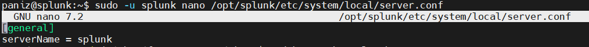

# Splunk Enterprise Configuration Guide

This guide provides step-by-step procedures for configuring and managing Splunk Enterprise.

## Configuration Steps

1. [General Configuration](#1-general-configuration)
2. [Server Configuration](#2-server-configuration)
3. [Network Configuration](#3-network-configuration)
4. [Splunk Configuration Files](#4-splunk-configuration-files)
5. [Configuration Precedence](#5-configuration-precedence)
6. [Apply Configuration Changes](#6-apply-configuration-changes)

---

## 1. General Configuration

Splunk Enterprise provides several general settings that control the basic configuration of the Splunk instance.

To access the general server settings, navigate to:

**Settings → Server settings → General settings**


This section provides access to general instance-level settings such as the Server Name and other basic configuration options.

### Server Name

The **Server Name** identifies the Splunk Enterprise instance.

The Server Name can be viewed from:

**Settings → Server settings → General settings**

In this instance, the configured Server Name is:

```text
splunk
```

> **Note:** The Server Name should be unique within a Splunk deployment, especially when multiple Splunk instances are communicating with each other.

---

## 2. Server Configuration

This section covers the main server-level configuration settings of a Splunk Enterprise instance, including the Splunk Web port, management port, and the main server configuration file.

### 2.1 Splunk Web Port

Splunk Web uses port `8000` by default.

The Web port is used to access the Splunk Web interface through a web browser.

The configured Web port can be verified from the command line:

```bash
sudo -u splunk /opt/splunk/bin/splunk show web-port
```

Example output:

```text
Web port: 8000
```

> **Note:** The Splunk Web port can be changed according to the deployment requirements. If the port is changed, make sure the new port is allowed through the host firewall and any applicable network security controls.

### 2.2 Splunk Management Port

Splunk Enterprise uses port `8089` as the default management port.

The management port is used for Splunk management operations and communication between Splunk components.

The configured management port can be verified using:

```bash
sudo -u splunk /opt/splunk/bin/splunk show splunkd-port
```

Example output:

```text
Splunkd port: 8089
```


> **Note:** The management port should not be exposed unnecessarily to untrusted networks.

### 2.3 Server Configuration File

Splunk Enterprise stores server-level configuration settings in the `server.conf` configuration file.

The local server configuration file is located at:

```text
/opt/splunk/etc/system/local/server.conf
```

For example, the Server Name is defined under the `[general]` stanza:

```ini
[general]
serverName = splunk
```

The `server.conf` file contains various server-level settings that control the behavior and configuration of the Splunk instance.



> **Note:** Do not modify sensitive configuration values unless you understand their purpose and the impact of the change. It is recommended to back up configuration files before making manual changes.

