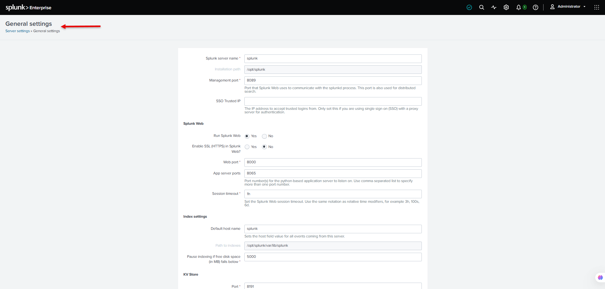
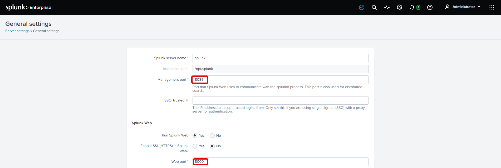

# Splunk Enterprise Configuration Guide

This guide provides step-by-step procedures for configuring and managing Splunk Enterprise.

## Configuration Steps

1. [General Configuration](#1-general-configuration)
2. [Server Configuration](#2-server-configuration)
3. [Network Configuration](#3-network-configuration)
4. [Splunk Configuration Files](#4-splunk-configuration-files)
5. [Configuration Precedence](#5-configuration-precedence)
6. [Apply Configuration Changes](#6-apply-configuration-changes)

---

## 1. General Configuration

Splunk Enterprise provides several general settings that control the basic configuration of the Splunk instance.

To access the general server settings, navigate to:

**Settings → Server settings → General settings**



This section provides access to general settings such as the Splunk server name, Web port, management port, and other instance-level configuration options.

> **Note:** Configuration options may vary depending on the Splunk Enterprise version and deployment type.

### Splunk Web and Management Ports

Splunk Enterprise uses different ports for Web access and internal management communication.

The default ports are:

| Port | Purpose |
|---|---|
| `8000` | Splunk Web |
| `8089` | Splunk Management |

The **Splunk Web port (8000)** is used to access the Splunk Web interface through a browser.

The **Management port (8089)** is used for management and communication between Splunk components.



> **Note:** The default ports can be changed according to the deployment requirements. If the ports are changed, make sure the required ports are allowed through the host firewall and any network security controls.

### Server Name

The **Server Name** identifies the Splunk Enterprise instance.

The Server Name can be viewed from:

**Settings → Server settings → General settings**

In this instance, the configured Server Name is:

```text
splunk
```

> **Note:** The Server Name should be unique within a Splunk deployment, especially when multiple Splunk instances are communicating with each other.
