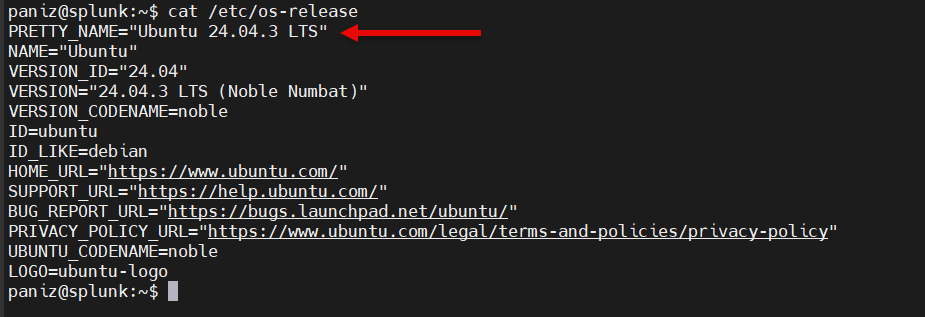
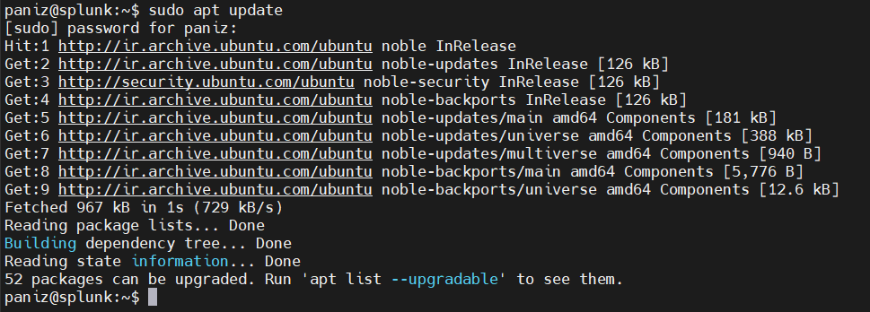
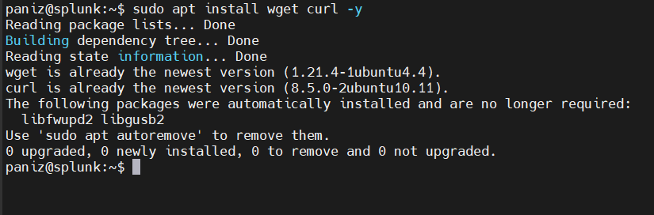
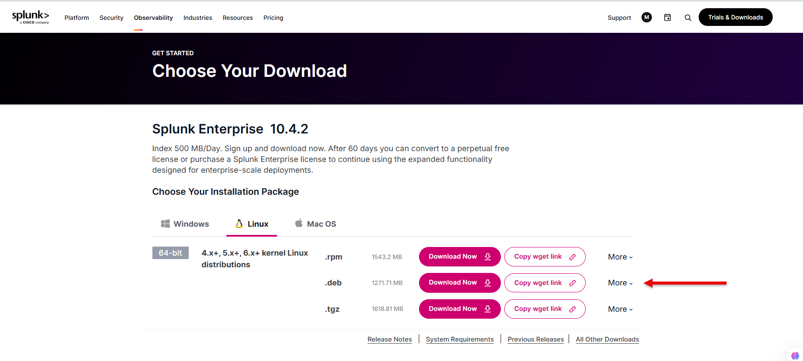
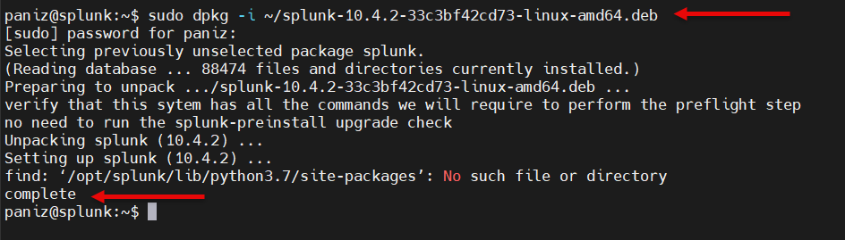
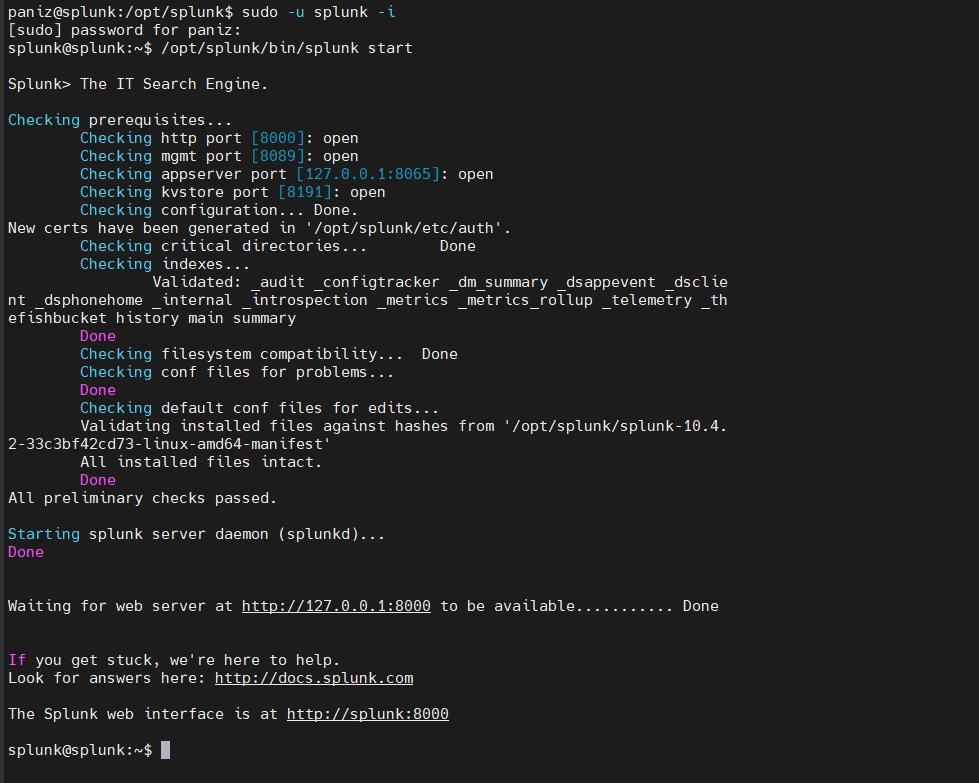
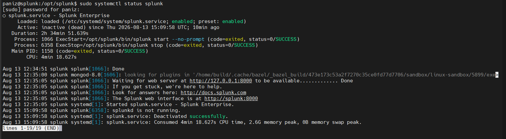
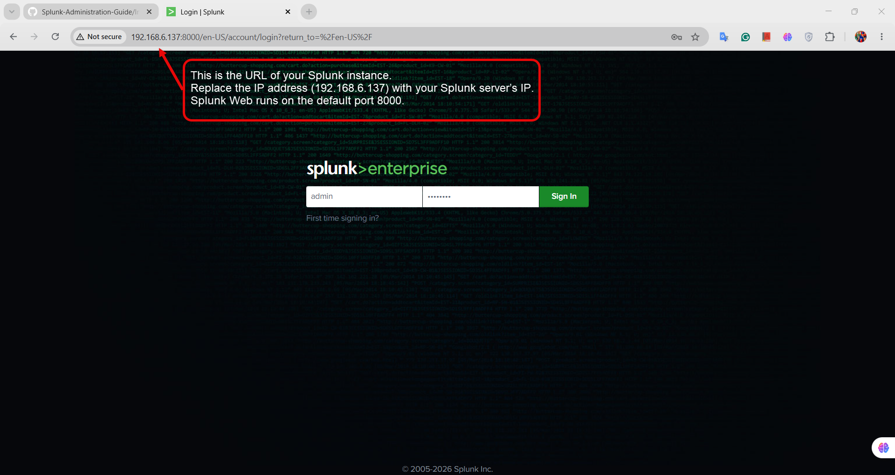
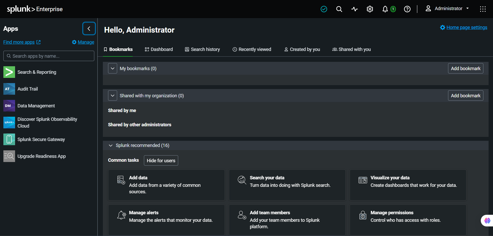
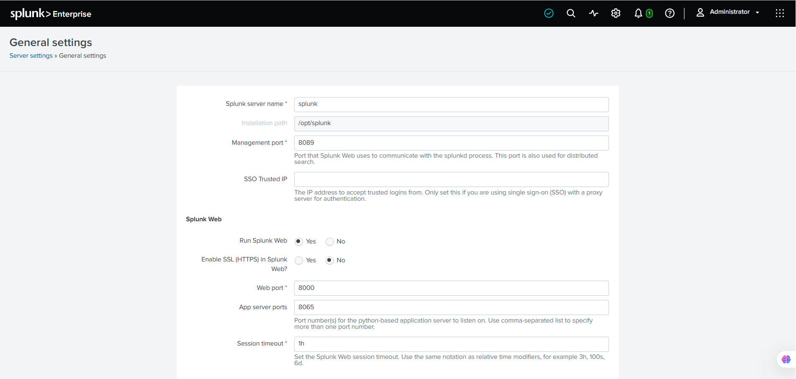

# Splunk Enterprise Installation on Ubuntu Server 24.04.3 LTS

This guide provides a step-by-step procedure for installing and configuring Splunk Enterprise on Ubuntu Server 24.04.3 LTS.

## Environment

| Component         | Version                   |
| ----------------- | ------------------------- |
| Operating System  | Ubuntu Server 24.04.3 LTS |
| Architecture      | amd64                     |
| Splunk            | Splunk Enterprise         |
| Installation Type | Single Instance           |


## Installation Steps

1. [Prerequisites](#1-prerequisites)
2. [Operating System Preparation](#2-operating-system-preparation)
3. [Download Splunk](#3-download-splunk)
4. [Install Splunk](#4-install-splunk)
5. [Start Splunk](#5-start-splunk)
6. [Enable Splunk at Boot](#6-enable-splunk-at-boot)
7. [Access Splunk Web](#7-access-splunk-web)
8. [Initial Configuration](#8-initial-configuration)
9. [Verify Installation](#9-verify-installation)

---

## 1. Prerequisites

Before installing Splunk Enterprise, verify that the server meets the required prerequisites.

### Operating System

This guide is based on Ubuntu Server 24.04.3 LTS.

Verify the operating system version:

```bash
cat /etc/os-release

```


### System Architecture

Verify the system architecture:

```bash
uname -m
```


## 2. Operating System Preparation

Before installing Splunk Enterprise, update the Ubuntu package repository.

### Update Package Repository

Run the following command:

```bash
sudo apt update
```



### Install Required Utilities

Install `wget` and `curl` to download and transfer files during the installation process.

```bash
sudo apt install wget curl -y
```

Verify the installation:

```bash
wget --version
curl --version
```


---

## 3. Download Splunk

Splunk Enterprise 10.4.2 is used in this guide.

For Ubuntu Server 24.04.3 LTS, the Debian (`.deb`) package for Linux x86-64 is used.

### Download the Splunk Enterprise Package

Download the following Splunk Enterprise package:

```text
splunk-10.4.2-33c3bf42cd73-linux-amd64.deb
```



After downloading the package, verify that the file is available on the Ubuntu server.

```bash
ls -lh splunk-10.4.2-33c3bf42cd73-linux-amd64.deb
```


## 4. Install Splunk

Install the downloaded Splunk Enterprise Debian package using `dpkg`.

### Install the DEB Package

```bash
sudo dpkg -i ~/splunk-10.4.2-33c3bf42cd73-linux-amd64.deb
```



The Splunk Enterprise package was successfully installed.

The default installation directory is:

```text
/opt/splunk
```

---

## 5. Start Splunk

After installing Splunk Enterprise, start Splunk using the following command:

```bash
sudo /opt/splunk/bin/splunk start --run-as-root
```

During the first startup, accept the Splunk Enterprise License Agreement.

After accepting the license agreement, you will be prompted to create an administrator username and password for Splunk.

> **Note:** The username and password created during the first startup will be used to log in to the Splunk Web interface. Keep these credentials secure and do not share or commit them to the repository.



> **Note:** Running Splunk Enterprise as root is deprecated. The `--run-as-root` option is used in this guide for this lab environment to avoid permission-related issues during the installation process. For production environments, running Splunk under a dedicated non-root user is recommended.

---

## 6. Enable Splunk at Boot

To start Splunk automatically when the operating system boots, enable the Splunk boot-start configuration.

### Enable Boot Start

Run the following command:

```bash
sudo /opt/splunk/bin/splunk enable boot-start
```




---

## 7. Access Splunk Web

After starting Splunk Enterprise, access the Splunk Web interface using a web browser.

### Access Splunk Web

Open a web browser and navigate to:

```text
https://<SPLUNK-SERVER-IP>:8000
```

Replace `<SPLUNK-SERVER-IP>` with the IP address of the Splunk instance.

The default port for Splunk Web is **8000**.



### Log in to Splunk Web

Use the administrator username and password created during the first startup of Splunk Enterprise.

> **Note:** The Splunk Web interface uses HTTPS by default. In a lab environment, the browser may display a certificate warning because Splunk uses a self-signed certificate by default.

### Splunk Web Dashboard

After successfully logging in, the Splunk Enterprise home dashboard is displayed.



### Server General Settings

To view the general configuration settings of the Splunk instance, navigate to:

**Settings → Server settings → General settings**

This section contains important configuration settings such as the Splunk server name, management port, and Splunk Web port. The default Splunk Web port is **8000**, while the default management port is **8089**. :contentReference[oaicite:0]{index=0}


